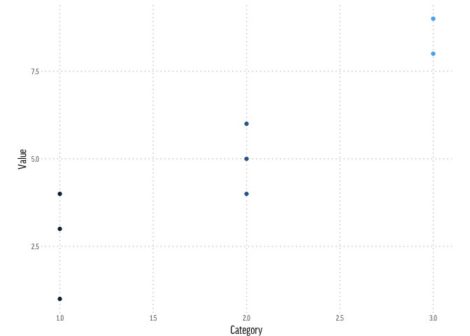

2: Other article
================

This is a mockup of the second article we would have.

``` r
outside_data <- read_csv("data/bogus-data.csv")
ggplot(outside_data, aes(x = Category, y = Value, color = Category)) + 
  geom_point() + 
  theme_ap()
```



Things to note about the structure:

-   Ease of presentation means we've chosen the `github_document` build option in Rmarkdown.

-   We wrap everything in the subfolder: so the raw data, the `.Rmd` file, the generated `.md` file, and the generated files (in `02-other-article_files`, usually images of plots) are all in the same folder.

-   So, we're committing data and images. This shouldn't be a problem, I hope.

-   We aren't using packrat. This is partly because it overcomplicates things (it is my hope that we aren't doing 'full' data analysis in these, but rather more straightforward exposition).

-   We link to and from the table of contents via the project root.

[**Back to Table of Contents**](https://github.com/larryfenn/Testing-GitHub-Markdown)
