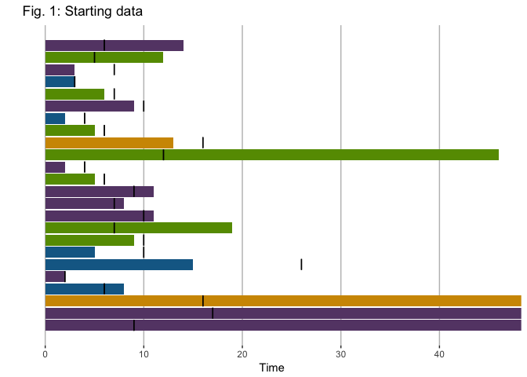
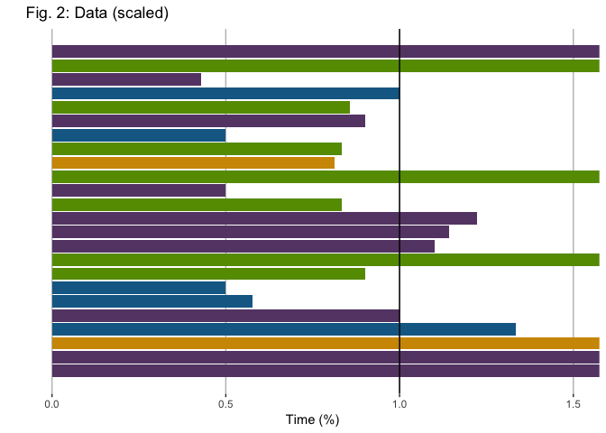
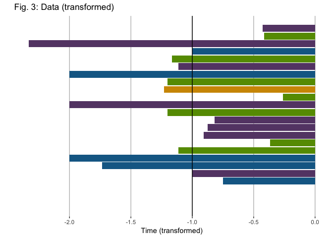
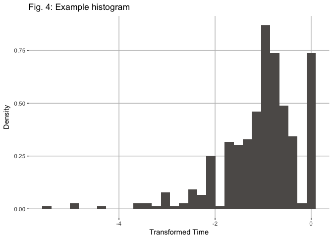
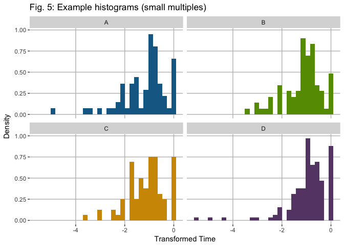
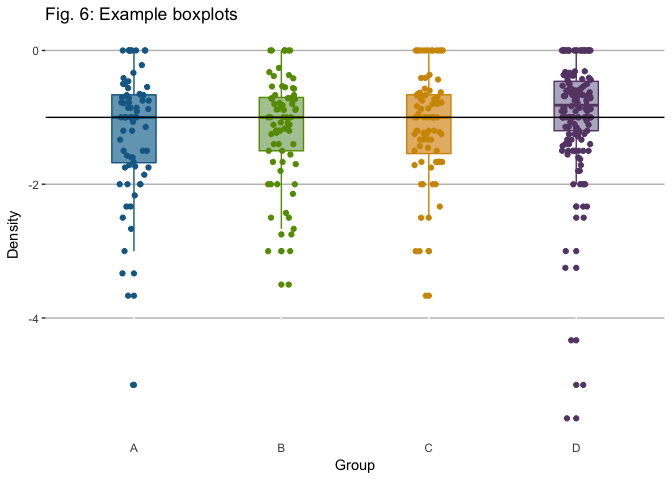

3: Completion statistics with unfinished tasks
================

Statistics for open-ended tasks
===============================

Problem
-------

*Setup*: There's four groups, with tasks assigned to each group. Tasks have an estimated completion time and an actual completion time; if no completion time exists yet, that is logged as `Inf`.

*Problem*: Having infinite values in data rules out a lot of data exploration and analysis.

Solution
--------

Below is a plot of tasks by completion time. The estimate is indicated by the black line. Tasks that have not finished yet run off the right hand side of the plot.

### Scaling

The first step is to scale every task by the estimated time. In terms of interpretation, this is equivalent to converting all of our completion times into percentages of the estimate.

### Transformation

Now we need to perform the main transformation. Note that with the `Inf` encoding, tasks are indeed ordered in the right order:

-   Tasks that are completed under estimate are on one side of `1`, with more quickly finished tasks closer to `0`.

-   Tasks that are completed over estimate are on the other side of `1`, with incomplete tasks off to infinity on the right hand side.

The key is to think about the two extreme cases:

-   Tasks that are finished instantly, regardless of estimate (`actual time = 0`, in other words).

-   Tasks that are incomplete (`actual time = Inf`).

Of these two cases, it turns out that incomplete tasks are far more frequent than tasks that are finished instantly; and in some sense, if the tasks are well-defined enough, tasks that are finished instantly are not possible in our data.

All other things being equal, tasks that finish exactly as estimated will be our reference point; the other two cases (instantly finished tasks and incomplete tasks), we swap via a transformation. The transformation that swaps `0` and `Inf` is `f: x -> 1/x`.

However, `1/x` has the effect of reversing the order as well: `1 < 2` but `1/1 > 1/2`. This is okay if we can keep that in mind, but since we've already gone through the trouble of applying this transformation, we can also fix that here: `f: x -> -1/x` will swap `0` and `Inf`, while preserving the order: `1 < 2` and `-1/1 < -1/2`.

It turns out that `f: x -> 1/x` has a physical interpretation if `x` is in units of time: it's the frequency. Whether or not this is useful depends on the context of where the task data comes from.

So what?
--------

Now we can do histograms and boxplots and the like without having to worry about infinite values blowing us up. The `0` bin will 'hold on' to all the incomplete tasks for us, and due to the way we've scaled things, all the tasks that have gone over the estimation will fall into the range between `-1` and `0`.

### Histograms

### Boxplots

The improvement here over simply throwing out the incomplete tasks is now those data points actually contribute to the statistical picture: incomplete tasks now contribute to pushing the boxplots closer to the x-axis (up, in this picture), and more rapidly completed tasks now push the boxplot down.

Other directions
----------------

-   If you only have task completion times without estimates, it is possible to do the same transformation. Instead of scaling all task times by estimates as before, the key is to try to work only on a groups of tasks that have the same 'complexity' scale.

-   Methods from survival analysis can also be used to study open-ended intervals in time.
